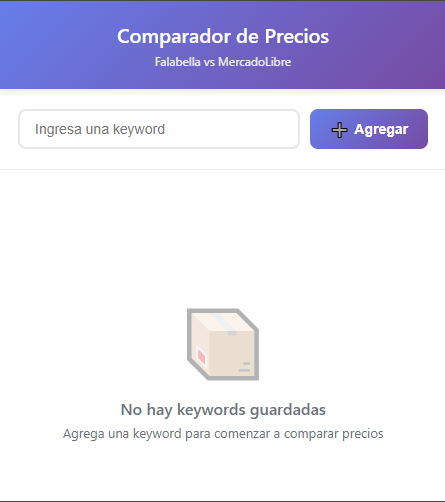
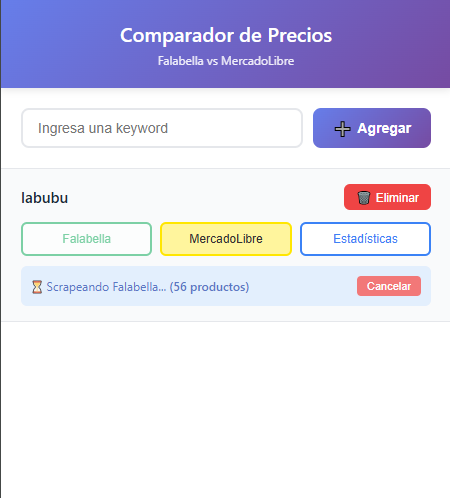

# Comparador de Precios por Keyword - Extensión MV3

## 📋 Descripción

Extensión de Chrome (Manifest V3) que permite comparar precios de productos entre Falabella y MercadoLibre mediante búsqueda por palabras clave. La extensión realiza scraping automatizado, normaliza los datos y proporciona estadísticas de productos similares para identificar oportunidades de ahorro.

## ✨ Características Principales

- 🔍 **Búsqueda por Keywords**: Crea y gestiona múltiples palabras clave de búsqueda
- 🏪 **Comparación Multi-Sitio**: Scraping simultáneo en Falabella y MercadoLibre
- 📊 **Análisis de Similitud**: Agrupación inteligente de productos similares
- 💰 **Oportunidades de Ahorro**: Ranking de productos con mayor diferencia de precio
- 💾 **Persistencia**: Almacenamiento local de keywords y resultados
- ⚡ **Scraping Eficiente**:
  - Falabella: mínimo 60 productos
  - MercadoLibre: mínimo 100 productos
- 🛑 **Cancelación Rápida**: Detención de scraping en < 1 segundo
- 📡 **Comunicación Persistente**: Uso de `tabs.connect` para actualizaciones en tiempo real

## 🚀 Instalación

### Requisitos Previos

- Google Chrome (versión 88 o superior)
- Conexión a internet

### Pasos de Instalación

1. **Clonar el repositorio**

```bash
git clone https://github.com/Retford/Comparador-de-Precios-por-Keyword.git
cd Comparador-de-Precios-por-Keyword
```

1. **Instalar dependencias**

```bash
npm install
```

1. **Compilar el proyecto**

```bash
npm run build
```

Esto generará la carpeta `dist/` con los archivos compilados de la extensión.

1. **Cargar la extensión en Chrome**
   - Abre Chrome y navega a `chrome://extensions/`
   - Activa el **Modo de desarrollador** (esquina superior derecha)
   - Haz clic en **Cargar extensión sin empaquetar**
   - Selecciona la carpeta `dist/` generada en el paso anterior

2. **Verificar instalación**
   - Deberías ver el ícono de la extensión en la barra de herramientas
   - Haz clic en el ícono para abrir el popup

## 📖 Uso

### 1. Agregar Keywords

1. Abre el popup de la extensión
2. Escribe una palabra clave en el campo de entrada (ej: "labubu", "laptop hp", "smartphone", "samsung galaxy")
3. Haz clic en **Agregar Keyword**
4. La keyword aparecerá en la lista persistente

### 2. Realizar Búsquedas

Para cada keyword agregada, tienes tres opciones:

- **🔍 Buscar en Falabella**: Inicia scraping en Falabella.com
- **🔍 Buscar en MercadoLibre**: Inicia scraping en MercadoLibre.cl
- **📊 Ver Estadísticas**: Muestra análisis comparativo de productos similares

### 3. Monitorear Progreso

Durante el scraping verás:

- **Estado**: Idle → Running → Done/Error/Cancelled
- **Contador**: Número de productos obtenidos en tiempo real
- **Botón Cancelar**: Detiene el proceso inmediatamente

### 4. Analizar Resultados

Al hacer clic en **Ver Estadísticas**:

- Productos agrupados por similitud
- Precios mínimo, máximo y promedio por grupo
- Comparación entre sitios
- Ranking de oportunidades de ahorro

### 5. Gestionar Keywords

- **Eliminar**: Botón 🗑️ para remover keyword y sus datos
- **Persistencia**: Todas las keywords y resultados se guardan automáticamente

## 🧠 Criterio de Similitud de Productos

### Enfoque Implementado

La extensión utiliza un **algoritmo de similitud basado en tokens y normalización de texto** para agrupar productos similares entre sitios. El proceso consta de las siguientes etapas:

#### 1. Normalización de Títulos

```typescript
// shared/utils.ts - Función de normalización
export function normalizeTitle(title: string): string[] {
  // Ejemplo de normalización
  // "Samsung Galaxy S23 128GB Negro" 
  // → "samsung galaxy s23 128gb negro"
  // → tokens: ["samsung", "galaxy", "s23", "128gb", "negro"]
  
  const stopwords = ['de', 'para', 'con', 'en', 'el', 'la', 'y', 'o'];
  
  return title
    .toLowerCase()
    .normalize('NFD')
    .replace(/[\u0300-\u036f]/g, '') // Eliminar acentos
    .replace(/[^a-z0-9\s]/g, ' ')     // Solo letras y números
    .split(/\s+/)
    .filter(token => token.length > 1 && !stopwords.includes(token));
}
```

- Conversión a minúsculas
- Eliminación de acentos y caracteres especiales
- Tokenización por palabras
- Remoción de stopwords comunes (ej: "de", "para", "con")

#### 2. Extracción de Características Clave

Se identifican y priorizan:

- **Marca**: Samsung, Apple, LG, Sony, etc.
- **Modelo**: Galaxy S23, iPhone 14, etc.
- **Especificaciones numéricas**: 128GB, 6.5", 8GB RAM
- **Variantes**: Color, tamaño, versión

#### 3. Cálculo de Similitud (Coeficiente de Jaccard)

```typescript
// popup/services/stats.ts
export function calculateSimilarity(tokensA: string[], tokensB: string[]): number {
  const setA = new Set(tokensA);
  const setB = new Set(tokensB);
  
  const intersection = new Set([...setA].filter(x => setB.has(x)));
  const union = new Set([...setA, ...setB]);
  
  return intersection.size / union.size;
  // similitud = (tokens_comunes) / (total_tokens_únicos)
}
```

**Ejemplo práctico:**

```typescript
const productA = "Samsung Galaxy S23 128GB Negro";
const productB = "Samsung Galaxy S23 128 GB Negro Liberado";

const tokensA = normalizeTitle(productA);
// ["samsung", "galaxy", "s23", "128gb", "negro"]

const tokensB = normalizeTitle(productB);
// ["samsung", "galaxy", "s23", "128gb", "negro", "liberado"]

const similarity = calculateSimilarity(tokensA, tokensB);
// Intersección: 5 tokens
// Unión: 6 tokens
// Similitud: 5/6 = 0.83 (83%)
```

#### 4. Umbral de Agrupación

- **Umbral mínimo**: 0.65 (65% de similitud)
- Productos con similitud ≥ 65% se agrupan
- Se priorizan matches exactos de marca + modelo

### Limitaciones Reconocidas

1. **Variaciones de Escritura**
   - "128GB" vs "128 GB" vs "128 Gb" se manejan mediante normalización
   - Abreviaturas no estándar pueden causar falsos negativos

2. **Sinónimos y Equivalencias**
   - "Celular" vs "Smartphone" vs "Teléfono" no se reconocen como equivalentes
   - No se detectan nombres alternativos de productos

3. **Especificaciones Implícitas**
   - Productos con descripciones minimalistas pueden no agruparse correctamente
   - Ej: "iPhone 14" vs "Apple iPhone 14 Pro Max 256GB" (baja similitud por diferencia de tokens)

4. **Bundles y Packs**
   - "Laptop HP + Mouse" se compara con "Laptop HP" como productos distintos
   - No se detecta si un producto incluye accesorios adicionales

5. **Sensibilidad a Detalles**
   - Diferencias menores (color, capacidad) pueden crear grupos separados
   - Balance entre precisión y recall

## 🔧 Arquitectura Técnica

### Componentes Principales

```tree
├── 📄 manifest.json           # Configuración MV3
├── 📄 package.json            # Dependencias del proyecto
├── 📄 tsconfig.json           # Configuración TypeScript
├── 📄 vite.config.ts          # Configuración del bundler
├── 📄 .gitignore              # Archivos ignorados por Git
│
├── 📁 icons/                  # Iconos de la extensión
│   ├── icon16.png
│   ├── icon48.png
│   └── icon128.png
│
├── 📁 docs/                   # Documentación y evidencias
│   ├── screenshots/           # Capturas de pantalla
│   │   ├── popup-main.png
│   │   ├── scraping-progress.png
│   │   └── statistics.png
│   └── video/                 # Videos demostrativos
│       └── demo-video.mp4
│
└── 📁 src/                    # Código fuente
    ├── 📁 background/         # Service Worker (MV3)
    │   ├── background.ts      # Punto de entrada del background
    │   └── manager.ts         # Gestión de conexiones y mensajes
    │
    ├── 📁 content/            # Content Scripts
    │   ├── index.ts           # Punto de entrada del content script
    │   └── scrapers/          # Scrapers por sitio
    │       ├── base.ts        # Clase base abstracta
    │       ├── factory.ts     # Factory pattern para scrapers
    │       ├── falabella.ts   # Scraper de Falabella
    │       └── mercadolibre.ts # Scraper de MercadoLibre
    │
    ├── 📁 popup/              # Interfaz de usuario
    │   ├── popup.html         # Estructura HTML
    │   ├── popup.ts           # Lógica principal del popup
    │   ├── style.css          # Estilos de la interfaz
    │   ├── services/          # Servicios de negocio
    │   │   └── stats.ts       # Cálculo de estadísticas y similitud
    │   └── ui/                # Gestión de UI
    │       └── render.ts      # Renderizado de componentes
    │
    ├── 📁 shared/             # Código compartido
    │   ├── storage.ts         # Wrapper de chrome.storage.local
    │   └── utils.ts           # Utilidades generales
    │
    └── 📁 types/              # Definiciones TypeScript
        └── index.ts           # Interfaces y tipos del proyecto
```

### Stack Tecnológico

- **TypeScript**: Tipado estático para mayor robustez
- **Vite**: Bundler moderno y rápido para desarrollo
- **Manifest V3**: API moderna de extensiones de Chrome
- **Programación Orientada a Objetos**: Patrón Factory para scrapers
- **Arquitectura Modular**: Separación clara de responsabilidades

### Comunicación Persistente (tabs.connect)

La extensión utiliza el patrón de comunicación persistente de Chrome con TypeScript:

```typescript
// popup.ts → content/index.ts
const port = chrome.tabs.connect(tabId, { name: "scraper" });

port.postMessage({ 
  type: "start", 
  keyword: "laptop", 
  site: "falabella" 
} as ScraperMessage);

port.onMessage.addListener((msg: ScraperResponse) => {
  switch(msg.type) {
    case "progress": // Actualizar contador
      updateProgress(msg.count);
      break;
    case "result":   // Guardar productos
      saveProducts(msg.products);
      break;
    case "error":    // Manejar error
      handleError(msg.error);
      break;
    case "cancel":   // Confirmar cancelación
      confirmCancellation();
      break;
  }
});
```

### Patrón Factory para Scrapers

```typescript
// scrapers/factory.ts
export class ScraperFactory {
  static create(site: SiteType): BaseScraper {
    switch(site) {
      case 'falabella':
        return new FalabellaScraper();
      case 'mercadolibre':
        return new MercadoLibreScraper();
      default:
        throw new Error(`Unknown site: ${site}`);
    }
  }
}

// scrapers/base.ts
export abstract class BaseScraper {
  abstract scrape(keyword: string): Promise<Product[]>;
  abstract handlePagination(): Promise<void>;
  abstract extractProduct(element: HTMLElement): Product | null;
}
```

### Estructura de Datos

```typescript
// types/index.ts

export interface Product {
  site: 'falabella' | 'mercadolibre';
  keyword: string;
  timestamp: number;
  position: number;
  title: string;
  priceVisible: string;
  priceNumeric: number;
  url: string;
  brand?: string;      // opcional
  seller?: string;     // opcional
}

export interface KeywordData {
  keyword: string;
  products: {
    falabella: Product[];
    mercadolibre: Product[];
  };
  lastUpdate: {
    falabella?: number;
    mercadolibre?: number;
  };
}

export interface SimilarityGroup {
  id: string;
  products: Product[];
  falabellaCount: number;
  mercadolibreCount: number;
  minPrice: number;
  maxPrice: number;
  avgPrice: number;
  priceDifference: number;
  savingsPercentage: number;
}
```

## 📊 Evidencia de Funcionamiento

### Capturas de Pantalla

#### 1. Interfaz Principal



*Vista del popup con keywords agregadas y estados de scraping*

#### 2. Scraping en Progreso



*Indicador de progreso con contador de productos en tiempo real*

#### 3. Estadísticas Comparativas


*Análisis de productos similares con oportunidades de ahorro*

### Video Demostrativo

📹 [Ver video de demostración](docs/video/demo-video.mp4)

**Contenido del video:**

- Agregar keywords
- Ejecutar scraping en ambos sitios
- Visualizar progreso y cancelación
- Análisis de estadísticas
- Persistencia de datos

## 🛠️ Tecnologías Utilizadas

- **TypeScript**: Lenguaje con tipado estático para mayor seguridad y mantenibilidad
- **Vite**: Build tool moderno y rápido con HMR (Hot Module Replacement)
- **Manifest V3**: Última versión de la API de extensiones de Chrome
- **Chrome APIs**:
  - `chrome.storage.local`: Persistencia de datos
  - `chrome.tabs`: Gestión de pestañas y navegación
  - `chrome.runtime`: Comunicación entre componentes
  - `chrome.scripting`: Inyección dinámica de scripts
- **Patrones de Diseño**:
  - **Factory Pattern**: Creación de scrapers específicos por sitio
  - **Abstract Class**: Clase base para todos los scrapers
  - **Observer Pattern**: Comunicación mediante eventos y mensajes
- **DOM Manipulation**: Scraping dinámico tolerante a cambios
- **MutationObserver**: Detección de carga dinámica de contenido
- **ES Modules**: Sistema de módulos moderno para mejor organización

## 🐛 Manejo de Errores

La extensión incluye manejo robusto de errores para:

- ❌ Páginas que no cargan correctamente
- ❌ Cambios en la estructura del DOM
- ❌ Límites de rate limiting
- ❌ Conexión interrumpida
- ❌ Datos inconsistentes o faltantes

Todos los errores se registran sin romper la funcionalidad general.

## 👤 Autor

**RETFORD**

- GitHub: [@retford](https://github.com/retford)
- Email: <retfordjb@gmail.com>
